
## Project : PfSense:  configure  a  client-to-site  VPN- SSL  with  OpenVPN

**Summary**

While  the  use  of  teleworking  has  intensified  in  recent  months,  the  demand  for nomadic  and  remote  access  is  growing.  To  implement  this  type  of  access, we  generally  rely  on  our  firewall.

**In  this  tutorial  I  will  show  you  how  to  configure  an  SSL  VPN client-to-site  under  PfSense  via  OpenVPN  to  allow  your  PCs  to  access distance  from  company  resources.** 

As  a  reminder,  this  type  of  VPN  is  used  to  establish  a  direct  link  between  the  PC  and  the  network. the  company,  thanks  to  an  encrypted  and  secure  tunnel.

For  this  example,  we  will  use a  local  user  base at firewall level. The  ideal  is  to  rely  on  an  external  LDAP  directory,  such  as  a Active  Directory  for  example  (reuse  of  identifiers  and  passwords pass).  The  procedure  remains  the  same,  it  is  only  the  authentication  source  which differs  and  it  will  be  enough  to  first  declare  your  directory  on  the  Firewall.

Here  is  the  diagram  of  the  present  case,  I  will  let  you  read  it  in  particular regarding  the  addresses  of  the  different  networks:

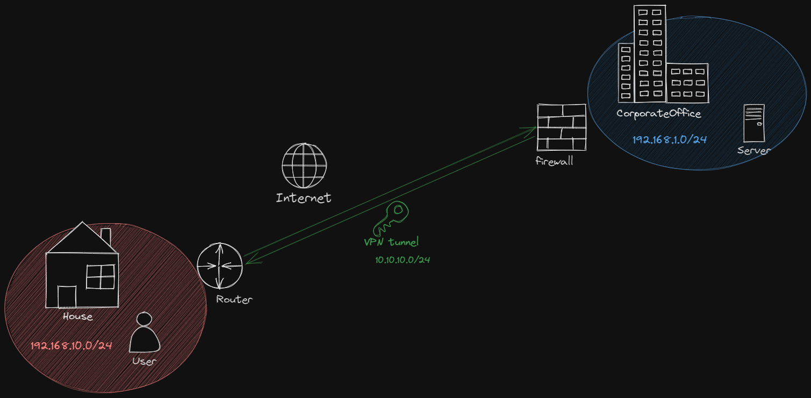

- [What  is  a  VPN?](https://mullvad.net/en/vpn/what-is-vpn)
- [What  is  OpenVPN?](https://openvpn.net/faq/what-is-openvpn/)

### Certificate  management

We  must  create  an  internal  certification  authority  on  the  PfSense  firewall,  then we  will  create  a  certificate  dedicated  to  the  server.  This  certificate  will  be  used  to secure  our  VPN  tunnel.

### 1. Create  the  certificate  authority

To  create  the  certificate  authority  on  pfSense  (if  you  don't  already  have  one), you  must  access  the  menu:  **System  >  Certificates**

In  the  **"Authorities"**  tab ,  click  on  the  **"Add"  button.**

Give  a  name  to  the  certification  authority  this  name  will  only  be  visible  in  Pfsense.

Choose  the  **"Create  an  internal  Certificate  Authority" method.**

Regarding  the  name  that  will  be  **displayed  in  the  certificates,  this  is  the  field “Common  Name”,**  I  indicate  “shadow”  for  my  part.  Fill  in  the values :  the  region,  the  city,  etc...  and  click  on  **"Save"**  to  create  the  CA.

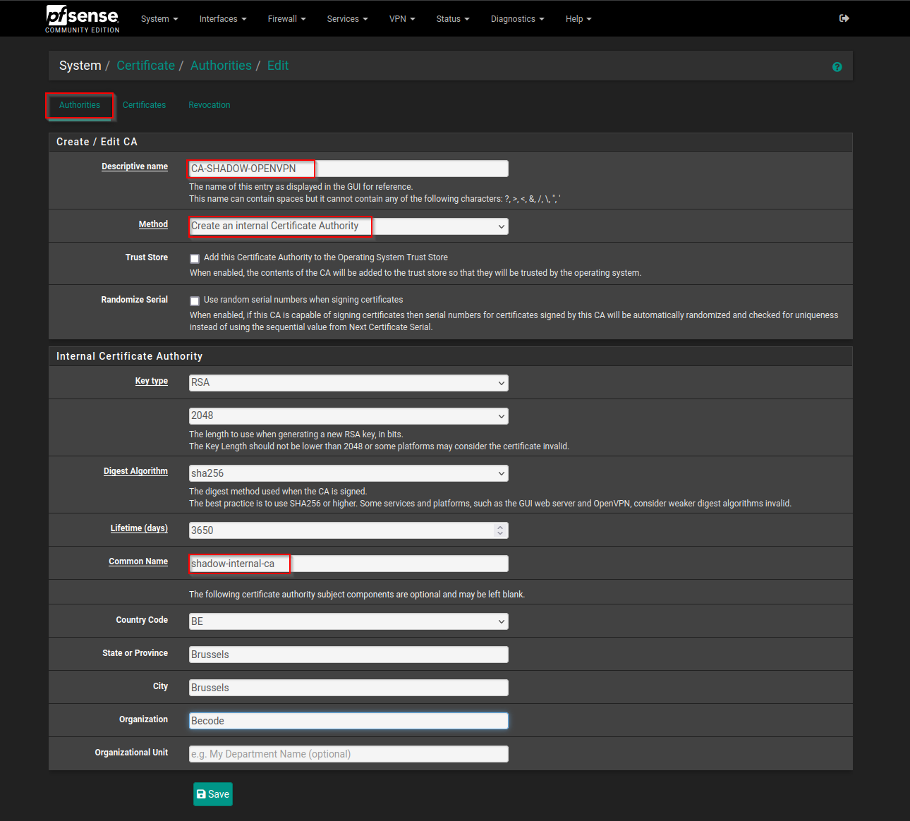

### 2. Create  the  Server  certificate

We  need  to  create  a  "Server"  type  certificate  based  on  our  new certification  authority.  Still  in  **"Certificate  Manager",**  this  time  in "Certificates"  tab ,  click  on  the  **"Add/Sign"  button.**

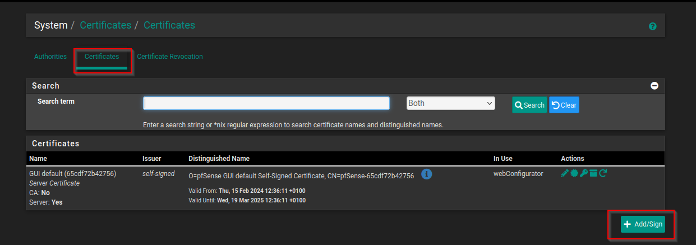

Choose  the  **"Create  an  Internal  Certificate"**  method  since  it  is  a

creation,  give  it  a  name  ***(VPN-SSL-REMOTE-ACCESS)***  and  select  the  authority certification  at  the  **"Certificate  authority"  parameter.**

**By  default,  the  validity  of  the  certificate  is  set  at  3650  days  or  10  years.**  THE **"Common  Name"**  also  corresponds  to  the  name  integrated  into  the  certificate,  **if  you want  to  establish  a  VPN  connection  based  on  a  domain  name,**  it  is better  to  indicate  this  value  here.

Choose  the  following  **certificate  type** :  Server  Certificate.

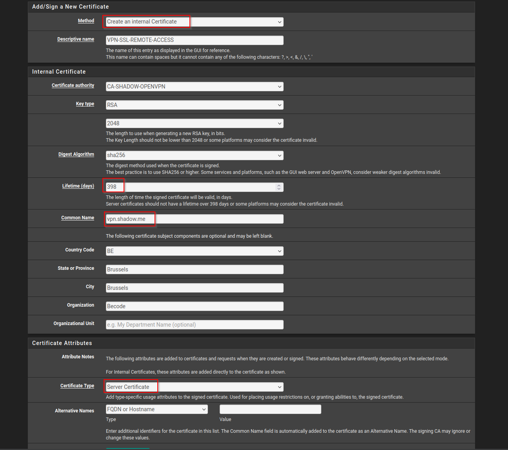

After  clicking  on  **"Save"**  to  **validate  the  creation  of  the  certificate,**  it  appears  in the  list  of  Firewall  certificates.

The  certificate  part  is  over,  let's  move  on.

### 3. Create  local  users

As  I  said  in  the  introduction,  we  are  going  to  use  an  internal  account  database to  the  Firewall  in  this  example.  So  we are going  **to  create  a  user  as  well  as  a “User”  type  certificate  for  VPN  authentication.**

To  create  the  user,  you  must  indicate  an  identifier,  a  password,  etc.  As  well  as check  the  **“Click  to  create  a  user  certificate”**  option :  this  will  add  the  form
creation  of  the  certificate  just  below. To  create  the  certificate,  we  base  ourselves  on  our certification  authority.

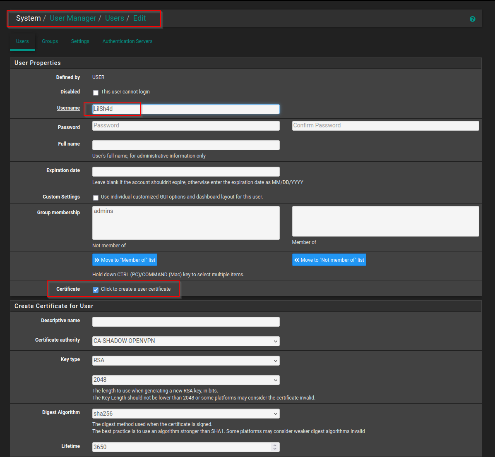

When  the  user  is  created,  it  appears  in  the  local  database.

### 4. Configure  OpenVPN  server

Now  that  the  certificate  part  is  operational  and  we  have  a user  account,  we  can  tackle  the  configuration  of  the  VPN.

Click  on  the  **“VPN”**  menu  then  **“OpenVPN”**
In  the  **"Servers"**  tab ,  click  **"Add"**  to  create  a  new  configuration.

The  first  thing  to  do  is  to  choose  the  following  **“Server  Mode” :  Remote Access  (SSL/TLS  +  User  Auth).**

For  the  VPN,  the  protocol  is  based  on  UDP,  with  **port  1194  by  default:  I recommends  that  you  use  a  different  port.**  For  the  interface,  we  will keep  "WAN"  since  it  is  through  this  interface  that  we  will  connect  in remote  access.

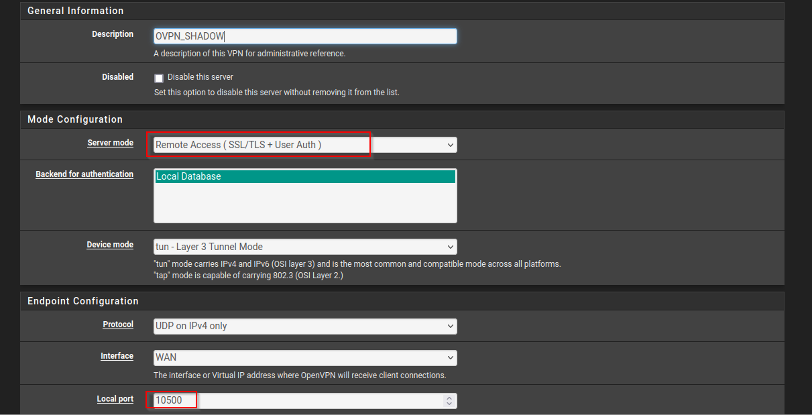

In  the  encryption  part,  a  little  further  down  the  page,  you  must select  your  certification  authority  in  the  **"Peer  Certificate"**  field **Authority".**  Additionally,  select  the  Server  certificate  in  the  field **"Servercertificate".**

For  the  encryption  algorithm  **(Encryption  Algorithm),**  we  can  switch  to  **AES-256-CBC**  rather  than  AES-128-CBC.  Security  will  be  reinforced,  but This  slightly  impacts  performance,  as  the  encryption  process  is
weighed  down:  it  will  always  be  possible  to  modify  this  value.

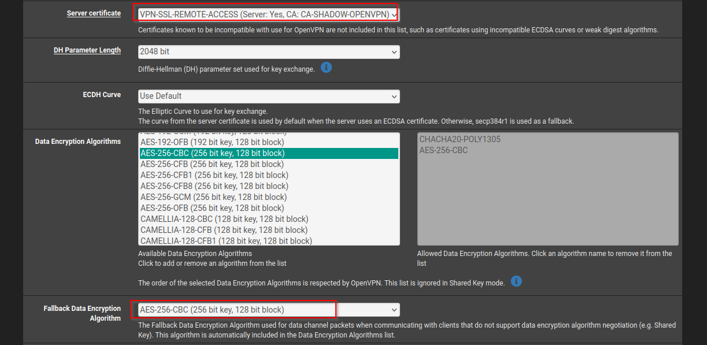

It  is  not  necessary  to  modify  the  others encryption-related  options.

**Now  let's  move  on  to  configuring  our  VPN  tunnel  itself.**

- **IPv4  Tunnel  Network :**  address  of  the  VPN  network,  i.e.  when  a  client  goes connect  via  VPN  it  will  obtain  an  IP  address  in  this  network  at  the  level  of  the PC  local  network  card
- **Redirect  IPv4  Gateway :**  if  you  check  this  option,  you  go  to  full tunnel,  that  is  to  say  that  all  network  flows  from  the  remote  PC  will  pass  through  the  VPN, otherwise  we  are  in  split-tunnel

- **IPv4  Local  network :**  the  network  addresses  of  the  LANs  that  you  wish  to  make accessible  via  this  VPN  tunnel.  In  my  example,  I  want  to  make  the network  10.5.0.1/24  via  VPN.  If  you  have  several  values  to  indicate,  you  must separate  them  with  a  comma

- **Concurrent  connections :**  the  number  of  simultaneous  VPN  connections  you allow.

For  client  settings,  I  **recommend  checking  the  option**

**"Dynamic  IP" :**  if  a  client's  public  IP  address  changes,  they  will  be  able  to  maintain  their VPN  connection.  This  is  especially  useful  if  you  have  people  connecting  via 4G  connection  and  mobility.

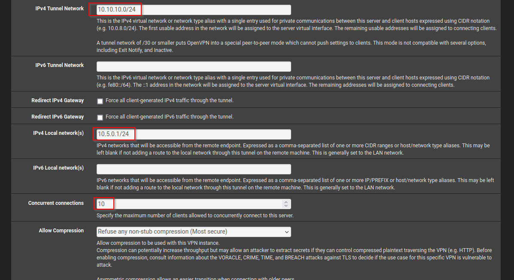

At  the  **“Topology”**  level,  very  important  remark  to  take  into  account : for  security  reasons,  it  is  better  to  use  the  **"net30  -  isolated /30"**  topology

**network  per  client"**  so  that  **each  client  is  isolated  in  a  subnetwork  (of  the VPN  network  range)  so  that  clients  cannot  communicate  with  each  other !**

**This  is  not  without  consequences:**  rather  than  a  VPN  connection  consuming  a

IP  address  on  the  network  range  dedicated  to  the  VPN,  **it  will  consume  4  IP  addresses :** an  IP  address  for  the  PC,  an  IP  address  for  the  firewall  and  the  addresses  of network  and  broadcast  of  the  subnet  in /30.

- **If  you  need  more  than  60  simultaneous  VPN  connections,  you  do  not  need  to You  should  not  use  a  VPN  network  in /24,  but  you  must  take  a  wider  one.** In  this  case,  modify  the  ***"IPv4  Tunnel  Network"***  value  defined  previously. 

If  you  need  to  use  your  company's  internal  DNS  resolution,  in  this case  you  can  broadcast  a  DNS  server.  Check  the  **“Provide  a  DNS  server”** option **list  to  customers.  Addresses  may  be  IPv4  or  IPv6"**  and  indicate  below  the  IP  addresses  of  your  DNS  servers.

Also  check  the  option  **“Provive  a  default  domain  name  to  clients”**  to indicate  your  local  domain  name.

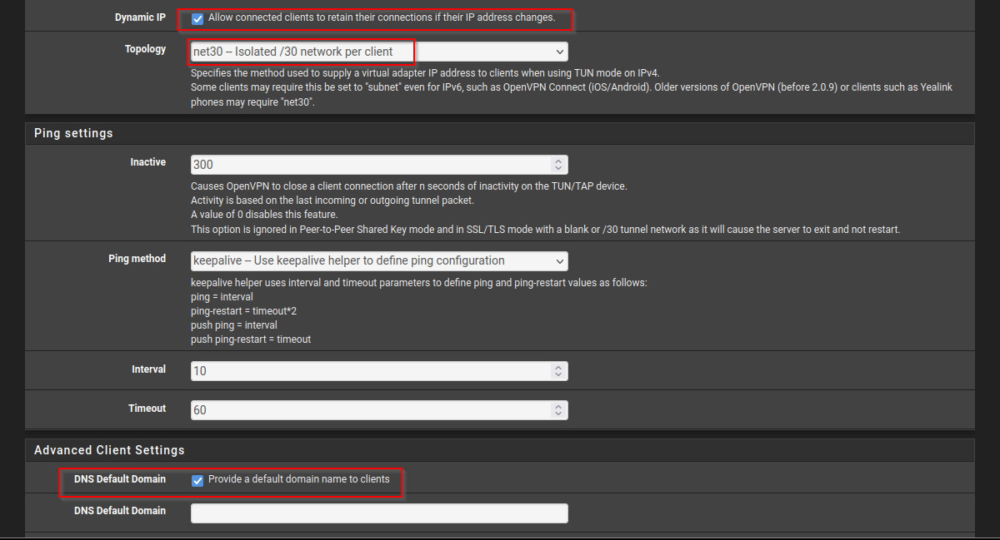

Scroll  down  the  page...  We're  nearing  the  end.  In  the  **"Custom"**  area 

**options",**  specify:  **auth-nocache.**  This  option  provides  additional  protection against  credential  theft  by  refusing  caching.

Validate  the  configuration...  Your  VPN  configuration  is  ready:

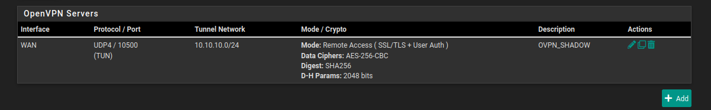

### 5. Export  OpenVPN  configuration

To  download  the  configuration  in  ".ovpn"  format,  it  is  necessary  to  install  a additional  packet  on  our  firewall.  Go  to  the  following  menu:

**System  >  Package  Manager  >  Available  Packages.**

Search  for  "openvpn"  and  install  the  package:  **openvpn-client-export.**

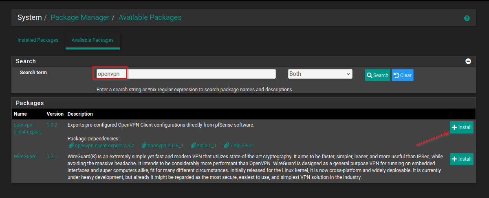

When  done,  return  to  the  **“OpenVPN”**  menu  then  to  the  **“Client”**  tab **Export".**

If  you  want  to  use  the  public  IP  address  to  connect,  use  the  option

**"Interface  IP  Address"**  for  the  **"Host  Name  Resolution"  option.**  There  are  others possible  options,  notably  by  domain  name. The  other  options  can  be  left  by  default...  There  is  only  our  option 

**"auth-nocache"**  to  be  reported  in  the  additional  options  section.

Click  on  the  **“Save  as  default”**  button  at  the  bottom  of  the  page.

Below  the  configuration  section,  you  have  the  possibility  to  download  the configuration.  

**To  use  OpenVPN  Community,  you  will  need  to  take  the configuration  "Bundled  Configuration",**  in  archive  format  to  recover  all  the necessary  files. For mobile  use  with  OpenVPN  Connect,  take  the  **"Inline"**  configuration **Configuration".**

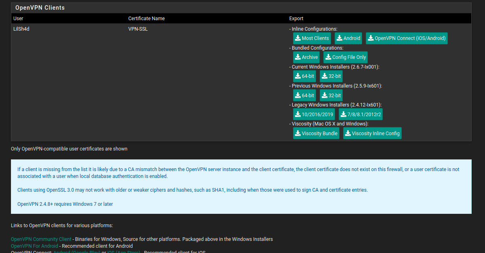

### 6. Create  firewall  rules  for  OpenVPN

On  the  one  hand,  we  need  to  **create  a  rule  to  allow  clients  to  mount  the VPN  connection,**  and  on  the  other  hand  we  must  **create  one  or  more  rules  to authorize  access  to  resources :**  server  in  RDP,  file  server,  application web,  etc.

1. Allow  OpenVPN  flow

**Click  on  the  “Firewall”  >  “WAN”  menu.**  It  is  necessary  to  create  a  new rule  for  the  WAN  interface,  selecting  the  **UDP  protocol.**

**The  destination  will  be  our  public  IP  address  so  select  “WAN address".**  For  the  port,  take  OpenVPN  from  the  list  or  indicate  your  port personalized.

If  you  wish,  you  can  add  a  description  to  this  rule  and  enable  the logs.

**Validate  the  creation  of  the  rule  and  apply  the  configuration.

From  this  point  on,  it  is  possible  to  mount  the  VPN  tunnel  on  a  PC,  but your  company's  resources  will  be  inaccessible.

2. Allow  flows  to  resources

**Add  a  new  rule,  this  time  on  the  OpenVPN  interface.**

The  following  rule  is  used  to  **authorize  RDP  access  to  the  host  10.5.0.11** 

from  the  network  authorized  in  the  VPN  configuration)  through  the  VPN  tunnel. You  **must  create  one  or  more  rules  based  on  resources**

**which  your  users  must  access  via  the  VPN,**  by  limiting  the  flows  to maximum.

- **If  you  use  your  company's  DNS  through  the  VPN,  consider  allowing  the**

**DNS  stream  to  your  DNS  server.**

For  the  destination,  it  will  therefore  be  my  host  and  port  3389  for  RDP.  Of  the  same way  as  for  the  previous  rule,  provide  a  description  and  activate  the

logging  if  you  like.

The  configuration  is  complete...  All  that  remains  is  to  test!
### 7. Test  remote  access  from  a  client  workstation

On  my  Windows  10  PC,  I  start  by  installing  the  OpenVPN  client...  Which  happens done  very  easily,  without  any  particular  difficulty!

`  `[ Download  OpenVPN](https://openvpn.net/community-downloads/)

In  the  **"C:\Programs\OpenVPN\Config"**  folder  you  must  **extract  the **content  of  the  ZIP  archive  downloaded  from  Pfsense  and  which  contains  the configuration.**  You  can  create  a  subfolder  in  the  "config"  folder  if  you want.

- **To  give  a  more  corporate  name  to  the  VPN  connection,  rename  the  file .ovpn:  its  name  will  be  the  one  given  to  the  configuration.**

Then,  on  the  OpenVPN  icon,  **right-click**  and  click  **“Connect”.**

You  must  provide  the  username  and  password,  corresponding  to  a AD  account  or  a  local  firewall  account,  depending  on  the  configuration.

When  the  VPN  tunnel  is  mounted  and  active,  the  icon  turns  green:

If  we  perform  an  ***ipconfig***  on  the  PC,  we  can  see  that  we  indeed  have  a IP  address  in  the  range  10.10.10.0,  with  a  subnet  at /30  for  isolation clients.

All  that  remains  is  to  establish  a  connection  to  your  servers,  via  RDP,  Web,  or  other,

according  to  your  needs !

**SSL  VPN  access  for  your  nomadic  or  teleworking  users  is now  operational!**

https://docs.netgate.com/pfsense/en/latest/recipes/openvpn-s2s-tls.html