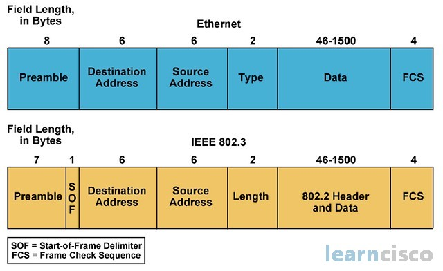
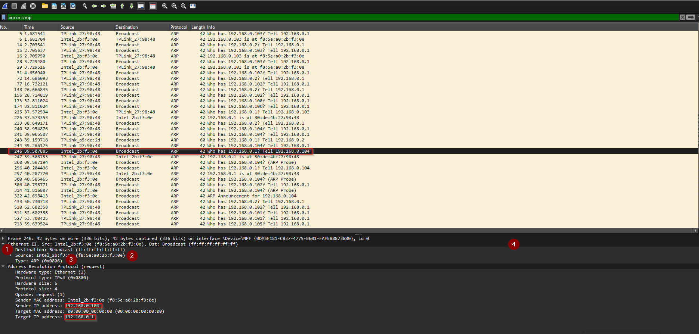
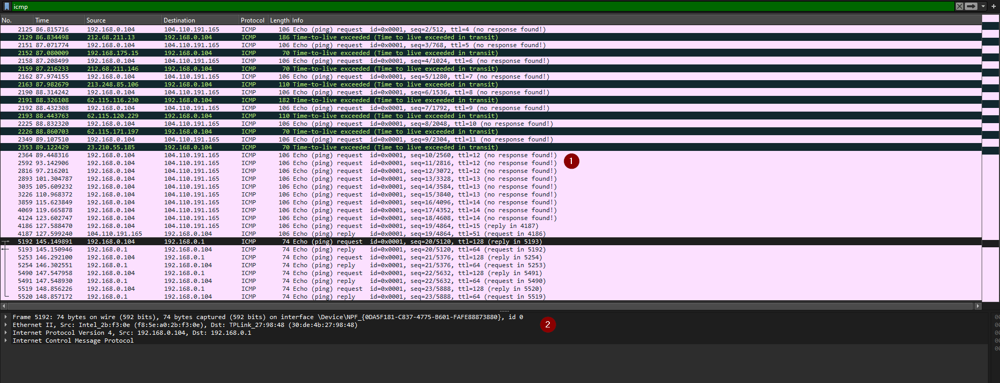
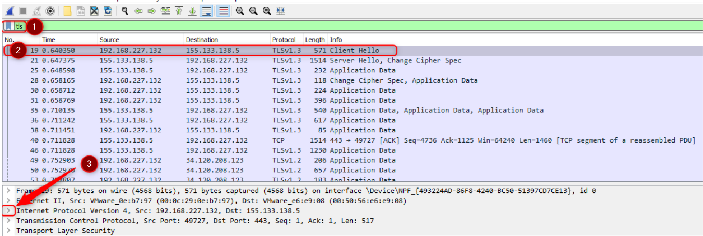

# Project: Use Wireshark to examine Ethernet frames

* Type : Solo
* Delay : 1 Days

### Objectives

- Examine header fields in an Ethernet II frame
- Using Wireshark to capture and analyze Ethernet frames

### Context

**When upper layer protocols communicate with each other, data flows through the layers of the OSI (Open Systems Interconnection) model and is encapsulated in a layer 2 frame.**

**Generally in a local area network (LAN), the layer 2 protocol is Ethernet.**

**When studying layer 2 concepts, it is helpful to analyze the header information of frames.**

**In the first part of this lab, you will examine the fields in an Ethernet frame. In the second part, you will use Wireshark to capture and analyze Ethernet frame header fields for local and remote traffic.**
### Resources required

- 1 PC with Internet access.
- Wireshark software installed on your PC

## Examining header fields in an Ethernet frame

In this section, you'll examine the header fields and contents of an Ethernet frame.
A Wireshark capture is used to examine the contents of these fields :



### Step 1: Examine the computer's network configuration

**Windows**

Open the command prompt and type `ipconfig /all`

```   
   Suffixe DNS propre à la connexion. . . :
   Description. . . . . . . . . . . . . . : Intel(R) Wi-Fi 6
   Adresse physique . . . . . . . . . . . : F8-5E-A0-2B-F3-0E
   DHCP activé. . . . . . . . . . . . . . : Oui
   Configuration automatique activée. . . : Oui
   Adresse IPv6 de liaison locale. . . . .: fe80::1285:c05e:e647:bde0%7(préféré)
   Adresse IPv4. . . . . . . . . . . . . .: 192.168.0.103(préféré)
   Masque de sous-réseau. . . . . . . . . : 255.255.255.0
   Bail obtenu. . . . . . . . . . . . . . : mardi 13 février 2024 08:01:52
   Bail expirant. . . . . . . . . . . . . : mardi 13 février 2024 12:02:10
   Passerelle par défaut. . . . . . . . . : 192.168.0.1
   Serveur DHCP . . . . . . . . . . . . . : 192.168.0.1
   IAID DHCPv6 . . . . . . . . . . . . .  : 100163232
   DUID de client DHCPv6. . . . . . . . : 00-01-00-01-2B-79-71-B8-8C-8C-AA-F8-A6-C6
   Serveurs DNS. . .  . . . . . . . . . . : 9.9.9.9
```

The PC's IP address is 192.168.0.103 and the default gateway 192.168.0.1

**Linux**

Open the command prompt and type `ip -c a`

```
1: lo: <LOOPBACK,UP,LOWER_UP> mtu 65536 qdisc noqueue state UNKNOWN group default qlen 1000
    link/loopback 00:00:00:00:00:00 brd 00:00:00:00:00:00
    inet 127.0.0.1/8 scope host lo
       valid_lft forever preferred_lft forever
    inet6 ::1/128 scope host
       valid_lft forever preferred_lft forever
2: eth0: <BROADCAST,MULTICAST,UP,LOWER_UP> mtu 1380 qdisc mq state UP group default qlen 1000
    link/ether 00:15:5d:59:a6:4e brd ff:ff:ff:ff:ff:ff
    inet 172.22.28.37/20 brd 172.22.31.255 scope global eth0
       valid_lft forever preferred_lft forever
    inet6 fe80::215:5dff:fe59:a64e/64 scope link
       valid_lft forever preferred_lft forever
```

In this example, the PC's IP address is 172.22.28.37

Open the command prompt and type `ip -c r`

```
default via 172.22.16.1 dev eth0 proto kernel
172.22.16.0/20 dev eth0 proto kernel scope link src 172.22.28.37
```

The default gateway has an IP address of 172.22.16.1

### Step 2: Examine Ethernet frames in a Wireshark capture

The screenshots in the Wireshark capture below show the packets generated by a ping sent
from a host PC to its default gateway. A filter has been applied to Wireshark to display the
ARP and ICMP protocols only. ARP stands for Address Resolution Protocol. ARP is a communication
used to determine the MAC address associated with the IP address. The session begins with
an ARP request for the MAC address of the gateway router.

This screenshot shows the details of an ARP request frame:


This screenshot shows the details of an ARP response frame

1: broadcast frame. Mac address = all to 1 or all to F
2 : Mac source address is that of the Windows10 virtual machine
3 : Protocol type = ARP

Intel_2b:f3:0e which is the MAC address of the Windows10 virtual machine
TPLink_27:98:48	is the MAC address of the Internet box.

### Step 3: Examine the Ethernet header contents of an ARP request

The following table takes the first frame in the Wireshark capture and displays the data present in the Ethernet header 

| Field | Value | Description |
| ---- | ---- | ---- |
| **Preambule** | Not displayed in capture | This field contains synchronization bits processed by the network card. |
| **Destination Address**   | Broadcast (ff:ff:ff:ff:ff:ff) | Layer 2 addresses two for the frame.<br>The address length is forty-eight bits or six bytes, expressed in 12 hexadecimal digits. The following format is common: f8:5e:a0:2b:f3:0e The first six digits correspond to the manufacturer of the network card, and the last six to the serial number. <br>The destination address can be a broadcast address containing only 1's, or a unicast address. |
| **Source Address** |  Intel_2b:f3:0e (f8:5e:a0:2b:f3:0e) |  |
| **Type** | 0x0806 | For Eternet frames, this field contains a hexadecimal value to indicate the type of upper layer protocol in the data field. Numerous upper layer protocols are supported by Ethernet Two types of standad are : <br>0x0800 IPv4 Protocol<br>0x0806 ARP Protocol  |
| **Data** |  | Contains the higher-level encapsulated protocol. The data field comprises between 46 and 1500 bytes. |
| **FCS** | Not displayed in capture | Frame check sequence, used by the network to identify errors during transmission. The value is calculated by the sending device, encompassing frame address, type and data field. It is checked by the receiver |

#### Questions :

- Why does the PC send an ARP broadcast before sending the first ping request?  
- Who owns the source MAC address in the request?  
- What is the vendor ID (YES) of the source NIC in the ARP response?  
- What is the serial number of the source NIC?

## Using Wireshark to capture and analyze Ethernet frames

In this part, you'll use wireshark to capture Ethernet frames and examine the information
contained in the frame headers.

### Step 1: Determine the IP address of the default gateway on your computer.

Open the command prompt and enter the command ipconfig
What is the IP address of the computer's default gateway?

### Step 2: Start by capturing traffic on your computer's network card

- Open Wireshark to start capturing data.
- Observe the traffic that appears in the Packet List window

### Step 3: Filter Wireshark to display ICMP traffic only

You can use the filter in Wireshark to block the visibility of unwanted traffic. 
The filter only blockswhat you want to display on screen. If you remove the filter, all captured traffic will be displayed.For the moment, only ICMP traffic should be displayed.In Wireshark's Filter field, enter icmp. The box will turn green if you have correctlythe filter. If the box is green, click Apply to apply the filter.

### Step 4: From the command prompt window, send a ping request to your computer's default gateway

In the command prompt window, send a ping request to the default gateway with the IP address
address you noted in step 1.

### Step 5: Stop capturing traffic on the network adapter

Click on the Stop Capturing Packets icon to stop traffic capture.

### Step 6: Examine the first Echo request (ping) in Wireshark.

The main Wireshark window is divided into three panes:
the Packet List pane (1),
the Packet Details pane (2)
the Packet Bytes pane (3)




If you have selected the correct interface for packet capture previously, Wireshark should display
ICMP information in the Wireshark Packet List.

- In the Packet List pane (top section), click on the first frame listed. Echo (ping)
request should appear below the Info header. The line should now be
highlighted.

- Examine the first line of the Packet Details pane (central section). This line shows the length of theframe length.

- The second line in the Packet Details pane indicates that this is an Ethernet frame. The
source and destination MAC addresses are also indicated.

#### Questions (to be completed according to YOUR machine):

- What is the MAC address of the computer's network card?
- What is the MAC address of the default gateway?

Note: You can click on the greater-than sign (>) at the start of the second line to obtain more information on the Ethernet frame.

- What type of frame is displayed?

Note: The last two lines in the middle section provide information on the frame's data field.
frame data field. Note that the data contains the IPv4 address information of the source and destination.

- What is the source IP address?
- What is the destination IP address?

Note: You can click on any line in the middle section to highlight that part of the frame (hex and ASCII). part of the frame (hex and ASCII) in the Packet Bytes pane (lower section). Click on the line
Internet Control Message Protocol (ICMP protocol) line in the middle section and examine what is
highlighted in the Packet Bytes pane.

- What are the last two letters of the highlighted bytes?

Note: Click on the next frame in the top section and examine an Echo response frame. Note
that the source and destination MAC addresses have been reversed, as this frame was sent from
the default gateway router in response to the first ping

- Which device and MAC address are displayed as the destination address?

### Step 7: Capture packets for a remote host

- Click on the Start Capture icon to start a new Wireshark capture.
A pop-up window prompts you to save previous captured packets to a file before
before starting a new capture. Click on Continue without Saving.

- Open a command prompt window and pin www.google.com

- Stop packet capture.

- Examine the new data in Wireshark's packet list.

#### Questions:

- In the first Echo request frame (ping), what are the source and destination MAC addresses?

- What are the source and destination IP addresses in the frame data field?

- Compare these addresses with those you received in step 6. The only address that has changed is the destination IP address. Why has the destination IP address changed, while the destination MAC address has remained the same?

- Wireshark doesn't display the preamble field of a frame header. What does the preamble field?

## Analyze a level 3 header: IP

Using the given wireshark capture, set up a TLS filter (1) then select the first frame (2) and finally
finally unfold the Internet Protocol Version 4 section (3)

Address 192.168.227.132 corresponds to a user station
Address 155.133.138.5 corresponds to a web site



#### Questions:

- You can use any source on the Internet, for example: https://www.frameip.com/entete-ip/

- In this example, what are the source and destination IP addresses?
- What flag is set, and what does it mean?
- What is the lifetime of the IP packet?
- Which protocol "above" IP is used in this frame?
###  Analyze a level 4 header

Use the same frame and fold out the IP part and unfold the Transmission Control Protocol (TCP) part.
#### Questions:

- What are the source and destination ports?

- What type of service is the destination?

- What flags are set, and what do they mean?

- In TCP, what do **Sequence Number** and **Acknoledgment Number** mean?

- What is **TCP Handshake**?

### Analyze Transport Layer Security (TLS)

Fold out the **Transmission Control Protocol** (TCP) section and unfold the **Transport Layer Security(TLS) section.** The captured frame is a frame showing a TLS exchange

#### Questions :

- Unfold the TLSv1.3 section, the Handshake Protocol section and then the Cipher Suite section.

- What does the Cipher Suite correspond to?

- Unfold the Extension section: **signature_algorithms** then **Signature Hash Algorithms**,  what does this mean? 

- Now, in wireshark, select the second line and look in Handshake Protocol: Server Hello, for the Cipher suite section.

- What do you find?

- What does the TLS Handshake step enable?
